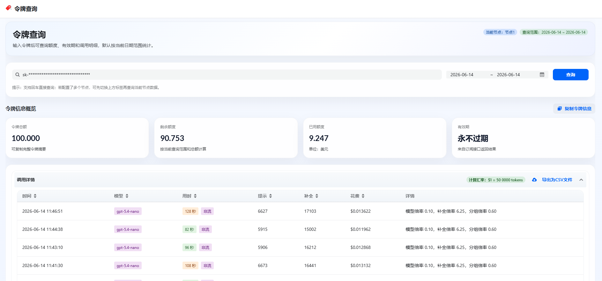

### 使用方法

#### Vercel 部署
1. 点击右侧按钮开始部署：
   [](https://vercel.com/new/clone?repository-url=https%3A%2F%2Fgithub.com%2Fcloudwebsite%2Fnew-api-key-tool&env=REACT_APP_SHOW_DETAIL&env=REACT_APP_SHOW_BALANCE&env=REACT_APP_BASE_URL&env=REACT_APP_SHOW_ICONGITHUB&project-name=new-api-key-tool&repository-name=new-api-key-tool)，直接使用 Github 账号登录即可，记得根据自己需求配置环境变量，环境变量如下： 

```   
REACT_APP_SHOW_BALANCE: 是否展示令牌信息，true 或 false
REACT_APP_SHOW_DETAIL: 是否展示调用详情，true 或 false
REACT_APP_BASE_URL: 你的NewAPI项目地址
REACT_APP_SHOW_ICONGITHUB: 是否展示Github图标，true 或 false
```

例如如下配置：
```
# 展示令牌信息
REACT_APP_SHOW_BALANCE=true

# 展示调用详情
REACT_APP_SHOW_DETAIL=true

# NewAPI的BaseURL（支持多个NewAPI站点聚合查询，键值对中的键为站点名称，值为站点的URL）
REACT_APP_BASE_URL={"server1": "https://example.newapi.ai", "server2": "https://example2.newapi.ai"}

# 展示GitHub图标
REACT_APP_SHOW_ICONGITHUB=true
```

3. 部署完毕后，即可开始使用；
4. （可选）[绑定自定义域名](https://vercel.com/docs/concepts/projects/domains/add-a-domain)：Vercel 分配的域名 DNS 在某些区域被污染了，绑定自定义域名即可直连。


### 二次开发
复制.env.example文件为.env，根据自己需求配置env文件中的环境变量。
